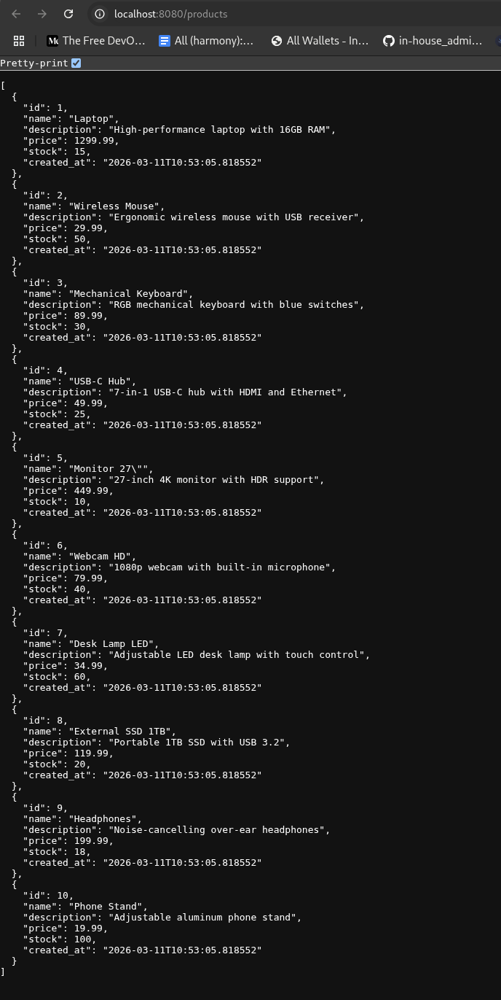

# Infrastructure Take Home

Treat this system as a production system.

## Getting Started

Clone this repository locally.
Create your own public git repository in github or somewhere we can access and push this code into it.
Make changes to your repository.
Getting things to work for you is part of the assessment.

You will be assessed by someone cloning your repository when you're finished and running your instructions to recreate the expected solution.
If we cannot run your repository instructions we cannot assess your work.

### Prerequsites

You will need the following:
* docker runtime and tools
* k3d CLI
* opentofu binary or terraform
* kubectl binary
* git

## Starting point

Use terraform or opentofu to initialise a k3d cluster and postgres instance locally from the `tofu` directory.
Install Argo CD into the k3d cluster by following the instructions in the `argocd` directory.

# Problem

Please add commits to your fork of the repo to answer this problem.
Note: the use of the word `postgrest` is confusing, but correct - this is a project that we're going to deploy.

## Add a user to the database

Please add a super user to the postgrest database.

## Inject a secret for postgrest

Creating a superuser account in this new database, inject the secrets into the k3d cluster into a namespace called postgrest.
You must do this with terraform/opentofu.

## Install Postgrest into the k3d cluster

https://docs.postgrest.org/en/v14/

The result should be an accessible endpoint that you can use in your browser.

## Inject some data from the cluster using a `Job`

Use a kubernetes job to inject some data into the postgres database

## Provide an expected screenshot

Update this file, README.md, with a screenshot of what we should see when we visit the URL after following your instructions - this should show us the data you have injected.

---

# Solution

## Setup Instructions

### Prerequisites

Before running the infrastructure setup, ensure you have the following installed:
- docker runtime and tools
- k3d CLI
- opentofu binary or terraform
- kubectl binary
- git

### Configuration

1. **Navigate to the tofu directory**:
   ```bash
   cd tofu
   ```

2. **Create terraform variables file from example**:
   ```bash
   cp terraform.tfvars.example terraform.tfvars
   ```

3. **Edit `terraform.tfvars`** and set secure passwords:
   ```bash
   # Use your preferred editor
   nano terraform.tfvars
   ```
   
   Update the following values with strong, unique passwords (replace the placeholder values):
   - `postgres_password = "your-secure-postgres-password"` → Set your PostgreSQL root password
   - `postgrest_user_password = "your-secure-postgrest-password"` → Set your PostgREST superuser password

   **⚠️ IMPORTANT**: Never commit `terraform.tfvars` to version control! It's already excluded in `.gitignore`.

### Deployment Steps

#### Step 1: Initialize Infrastructure (Two-Phase Deployment)

The infrastructure uses both Kubernetes and PostgreSQL providers. Due to provider initialization constraints, we use a two-phase deployment approach:

**Phase 1: Create k3d cluster and PostgreSQL database**
```bash
cd tofu  # If not already in tofu directory
tofu init
tofu apply -target=terraform_data.k3d_cluster -target=docker_volume.postgres_data -target=docker_image.postgres -target=docker_container.postgres -target=terraform_data.postgres_ready -target=postgresql_database.postgrest -target=postgresql_role.postgrest_super_user
```

**Phase 2: Create Kubernetes resources (namespace and secrets)**
```bash
tofu apply
```

**Why two phases?**
The Kubernetes provider attempts to connect to the k3d cluster during the planning phase, before Terraform creates it. The first phase creates the cluster, and the second phase creates resources within it.

#### Step 2: Install ArgoCD

```bash
cd ..  # Return to project root
kubectl apply --server-side -k argocd/argocd/
kubectl wait --for=condition=available --timeout=300s deployment/argocd-server -n argocd
```

#### Step 3: Deploy PostgREST via ArgoCD

```bash
kubectl apply -f argocd/postgrest-application.yaml
```

Wait for PostgREST to be deployed (this may take a minute as ArgoCD syncs from GitHub):
```bash
kubectl wait --for=condition=available --timeout=120s deployment/postgrest -n postgrest
```

#### Step 4: Inject Sample Data

```bash
kubectl apply -f postgrest/data-injection-job.yaml
kubectl wait --for=condition=complete --timeout=60s job/inject-sample-data -n postgrest
```

**Note**: PostgREST caches the database schema. After data injection, restart PostgREST to reload the schema:
```bash
kubectl rollout restart deployment/postgrest -n postgrest
kubectl rollout status deployment/postgrest -n postgrest
```

## Expected Result

After completing the setup, visit **http://localhost:8080/products** in your browser or use curl:

### Browser View



### Using curl

```bash
curl http://localhost:8080/products
```

### Expected Output

You should see a JSON array of 10 products:

```json
[
  {
    "id": 1,
    "name": "Laptop",
    "description": "High-performance laptop with 16GB RAM",
    "price": 1299.99,
    "stock": 15,
    "created_at": "2026-03-11T11:57:01.992511"
  },
  {
    "id": 2,
    "name": "Wireless Mouse",
    "description": "Ergonomic wireless mouse with USB receiver",
    "price": 29.99,
    "stock": 50,
    "created_at": "2026-03-11T11:57:01.992511"
  },
  {
    "id": 3,
    "name": "Mechanical Keyboard",
    "description": "RGB mechanical keyboard with blue switches",
    "price": 89.99,
    "stock": 30,
    "created_at": "2026-03-11T11:57:01.992511"
  }
  // ... 7 more products
]
```

### Access PostgREST OpenAPI Documentation

Visit **http://localhost:8080** to see the auto-generated OpenAPI documentation.

### Verify Components

- **K3d cluster**: `kubectl cluster-info`
- **PostgreSQL database**: `docker ps | grep postgres`
- **ArgoCD application**: `kubectl get application -n argocd`
- **PostgREST deployment**: `kubectl get pods -n postgrest`
- **Data injection job**: `kubectl get jobs -n postgrest`

## Architecture

- **PostgreSQL**: Running as a Docker container on the k3d network
- **K3d cluster**: Local Kubernetes cluster with Traefik ingress on port 8080
- **ArgoCD**: GitOps continuous delivery tool managing PostgREST deployment
- **PostgREST**: RESTful API automatically generated from PostgreSQL schema
- **Namespace**: All PostgREST resources deployed in `postgrest` namespace

## Key Components

1. **Database**: `postgrest` database with superuser `postgrest_super_user`
2. **Secret**: Kubernetes secret containing database connection URI (injected via Terraform)
3. **Table**: `products` table with 10 sample records
4. **API**: RESTful endpoints at http://localhost:8080

## Cleanup

To destroy all infrastructure:

```bash
cd tofu
tofu destroy
k3d cluster delete infra-takehome  # If needed
```
